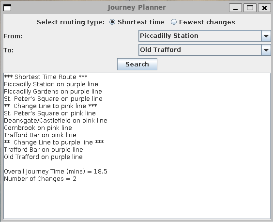

# metrolink-journey-planner
Java route planner for the Manchester Metrolink.



## How to run
**Compile:**
```bash
javac -d out $(find src -name "*.java")
```

**Run (GUI):**
```bash
java -cp out app.Main
```

**Run (CLI):**
```bash
java -cp out app.Main cli
```

